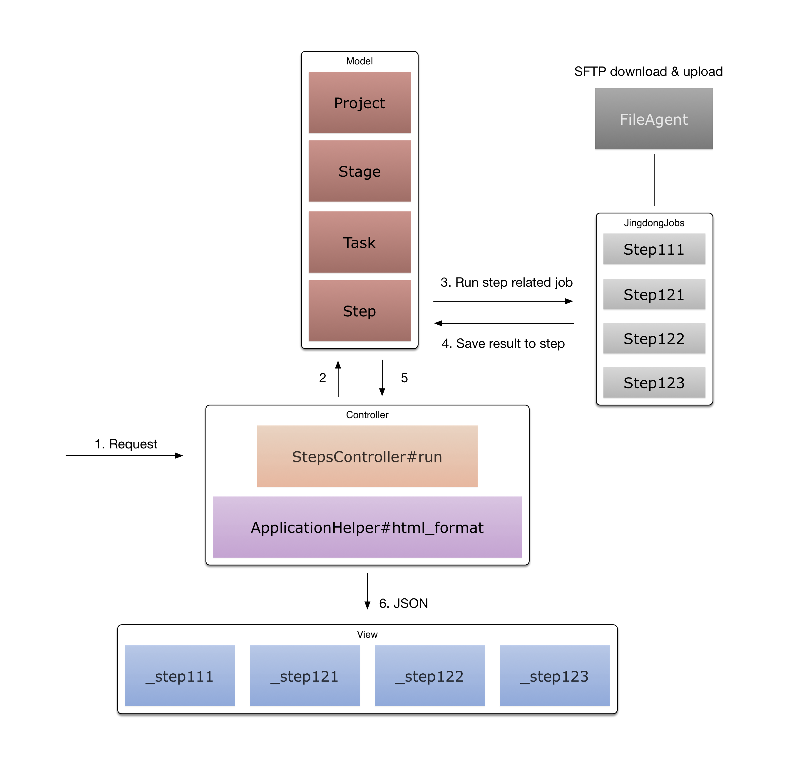

## Introduction

本项目旨在自动化开通与第三方机构（互联网平台、交易所）的对接过程。

参考文档

+ [对接京东 - 技术注意事项](https://quip.com/WLduAlYbiBPH)
+ [京东 - 开通 - 广交所上线操作流程](https://quip.com/ClscABmJ9SGn)

## Development

### Structure



### Recipe

已完成京东流程模板，在创建项目时加载 `config/recipes/jingdong.yml` 中预定义的相关任务：

```
name: 'Jingdong Default Project'
description: ''
recipe: 'jingdong'
stages:
  - name: '准备期'
    description: ''
    tasks:
      - name: '获取交易所上传的准备文件'
        description: ''
        steps:
          - name: '检查交易所是否上传文件至 FTP'
            description: ''
            job_id: "111"
...
```

通过 `job_id` 指定该 `step` 需执行的任务，即上例中 step 对应 `app/jobs/jingdong_job/step111.rb` 所定义的任务。


## Test

```
$ rake
```

## Deployment

Add ssh host

```
# ~/.ssh/config

Host kaitong.aliyun
  HostName 123.57.60.56
  User deploy
  Port 10080
```

Add public/resources link

```
$ mkdir ~/resources
$ ln -svf ~/resources {path-to-baton-web}/public
```

Dependent on [p7zip](https://wiki.archlinux.org/index.php/P7zip) for generating OSX/Linux/Win compatible zip file.

> Read this post for details http://goo.gl/k0esDi

```
$ brew install p7zip
$ sudo yum install p7zip p7zip-plugins # CentOS
$ sudo apt-get install p7zip-full p7zip-rar # Ubuntu
```


## Changelog

#### Version 0.1

项目原名为 ftp-monitor，用来监控 FTP 以及执行一些 thor 任务来完成与各机构的文件交互，这部分代码保存在 ftp-monitor 分支。

#### Version 1.0

1. 页面样式取自 [Departure](https://tryblocks.com/departure/index.html)，保存在 `lib/assets`
1. 项目级别 CRUD
2. 项目、阶段、任务、步骤，四层嵌套模型
3. 京东的流程模板（互联网平台：京东，交易所：广交所）

